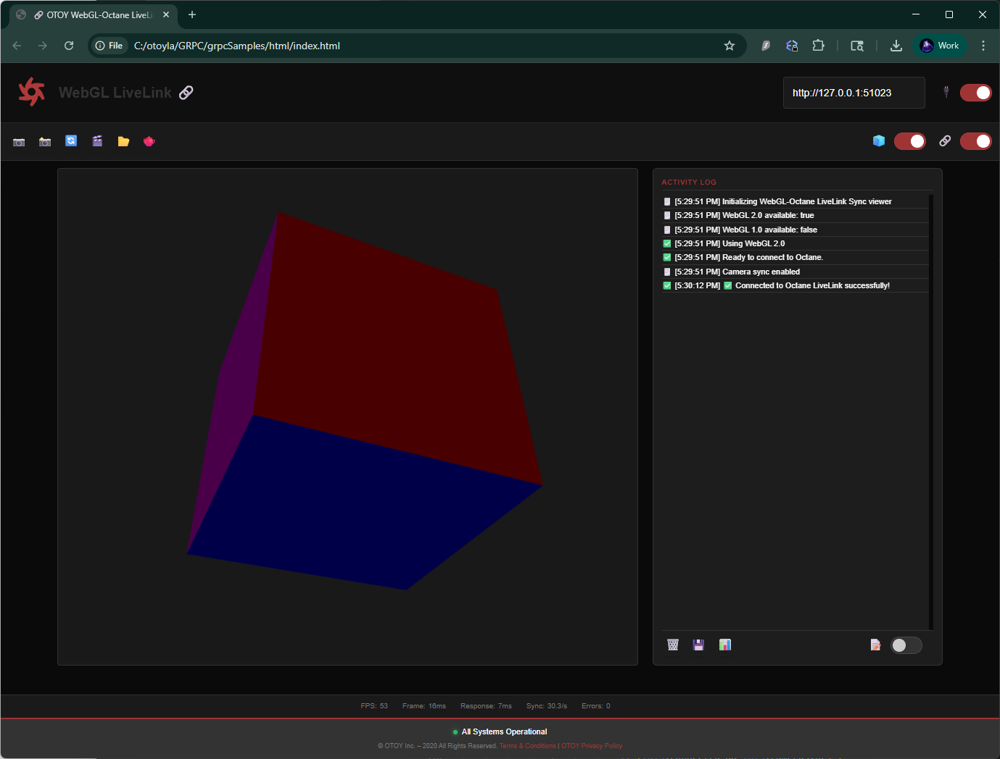

# Octane gRPC Samples
## Advanced 3D Rendering Pipeline Integration Architecture

**🏗️ SYSTEMS ARCHITECTURE INNOVATION** - Production-grade multi-platform integration suite demonstrating advanced gRPC-based 3D rendering pipeline connectivity. Implements bidirectional real-time synchronization between web browsers, native applications, and Octane Render's LiveLink service through sophisticated protocol abstraction layers.



## 🎯 Technical Architecture Overview

**🔬 CORE INNOVATION**: Custom gRPC-Web protocol implementation eliminating external dependencies while maintaining full API compatibility with Octane's native gRPC services. Demonstrates advanced browser-to-server communication patterns without traditional gRPC-Web limitations.

### 🏛️ Multi-Tier Architecture Design

**🌐 Web Tier (OctaneWeb v1.0)**:
- **Custom Protocol Stack**: Hand-crafted gRPC-Web implementation bypassing protobuf.js dependencies
- **Viewport Management System**: Absolute positioning with CSS Grid coordination for professional layout control
- **Real-time Synchronization Engine**: Bidirectional camera state management with 60fps update cycles
- **Component Architecture**: Modular ES6 classes with shared utility abstraction layer

**🖥️ Native Tier (C++ Applications)**:
- **Direct gRPC Integration**: Native protobuf compilation with optimized message serialization
- **Shared Component System**: Reusable camera synchronization and model loading abstractions
- **OpenGL Rendering Pipeline**: Modern OpenGL 3.3+ with efficient buffer management
- **Cross-platform Abstraction**: CMake-based build system supporting Windows/Linux/macOS

**🔄 Protocol Translation Tier**:
- **HTTP-to-gRPC Proxy**: Asynchronous Python server with comprehensive CORS middleware
- **Message Transformation**: JSON-to-protobuf conversion with type safety validation
- **Connection Pooling**: Efficient gRPC channel management with automatic reconnection
- **Development Mock Server**: Complete Octane API simulation for offline development

**🌐 Web Application Features**:
- Interactive 3D WebGL rendering with mouse controls (orbit, pan, zoom)
- Real-time camera synchronization with Octane Render
- Hierarchical scene tree with visibility controls and node management
- Visual node graph editor with auto-fit functionality
- Professional OTOY-branded UI with responsive design
- Custom gRPC-Web client with comprehensive API coverage

**🖥️ Desktop Applications**: C++ OpenGL viewers with varying integration levels
- **simpleGL**: Standalone 3D viewer with file loading
- **simpleGlGrpc**: Network camera sync without SDK dependencies  
- **simpleGlSdk**: Full SDK integration with real-time synchronization
- **testGrpcApi**: Advanced ImGui-based gRPC API testing interface

**🛠️ Development Infrastructure**: Complete development environment
- Python HTTP-to-gRPC proxy server with comprehensive logging
- Mock Octane server for development without Octane installation
- Cross-platform build system (Windows, Linux, macOS)
- Professional git workflow with descriptive commits and versioning

## 🔥 CRITICAL OBJECTPTR TYPE CONVERSION REQUIREMENT

**⚠️ MOST IMPORTANT DEBUGGING INSIGHT**: When calling different Octane API services, you MUST convert the ObjectPtr type field to match the target service, even if the handle stays the same.

**Example - The Critical Fix**:
```python
# ❌ WRONG - Copying original type causes "invalid pointer type" error
request.objectPtr.handle = object_ref.handle
request.objectPtr.type = object_ref.type  # ApiRootNodeGraph = 18

# ✅ CORRECT - Convert type to match target service
request.objectPtr.handle = object_ref.handle  
request.objectPtr.type = 16  # ApiItem type for ApiItemService calls
```

**ObjectType Enum Values** (from `common.proto`):
```proto
enum ObjectType {
    ApiItem = 16;           // For ApiItemService calls
    ApiNode = 17;           // For ApiNodeService calls  
    ApiRootNodeGraph = 18;  // For ApiRootNodeGraphService calls
    ApiNodeGraph = 20;      // For ApiNodeGraphService calls
}
```

**Key Insight**: The same object handle can be accessed through different API interfaces, but you must specify which interface you're using via the type field. This is polymorphism in the Octane API - one object, multiple interfaces.

## Quick Start

### Step 1: Start Octane Render
1. **Launch Octane Render** on your system
2. **Enable gRPC Server**: Go to Preferences → LiveLink → Enable gRPC Server
3. **Note the Port**: Default is usually 51023 (check Preferences → LiveLink → Port)

### Step 2: Start the Proxy Server

#### Windows
```cmd
html/start_proxy.bat
```

#### Linux/macOS
```bash
html/start_proxy.sh
```

### Step 3: Open the Web Application
Simply **double-click `index.html`** or drag it into your browser.

### Desktop Applications
# Build C++ applications

# Run applications
./simpleGL        # Standalone viewer
./simpleGlGrpc    # Network sync viewer  

## Repository Structure

```
grpcSamples/
├── html/                      # 🌐 Web applications
│   ├── index.html             # Main WebGL 3D viewer with Octane sync
│   ├── livelink.js            # Custom gRPC-Web client implementation
│   ├── shared.js              # Common utilities and helper functions
│   ├── webgl-utils.js         # WebGL rendering and 3D utilities
│   ├── otoy-theme.css         # Professional OTOY branding and styling
│   └── README_LIVELINK.md     # Web client documentation
├── proxy/                     # 🔄 HTTP-to-gRPC proxy server
│   ├── grpc_proxy.py          # Python proxy with comprehensive logging
│   ├── livelink_pb2.py        # Generated protobuf Python bindings
│   └── livelink_pb2_grpc.py   # Generated gRPC Python stubs
├── mock_octane/               # 🎭 Mock Octane server for development
│   ├── mock_octane_server.py  # Python mock server implementation
│   └── README.md              # Mock server documentation
├── shared/                    # 🔧 Common helper libraries (C++)
│   ├── camera_system.h        # Camera controls and input handling
│   ├── model_loader.h         # 3D model loading (OBJ/PLY/STL)
│   └── file_dialog.h          # Cross-platform file dialogs
├── simpleGL/                  # 🎯 Standalone 3D model viewer (C++)
├── simpleGlGrpc/              # 🌐 Pure gRPC network synchronization (C++)
├── simpleGlSdk/               # 🚀 Direct Octane SDK integration (C++)
├── sdk/                       # 📚 Octane SDK wrapper library
├── third_party/               # 📦 External dependencies
├── test_models/               # 🎲 Sample 3D models for testing
└── ORBX/                      # 🎨 Octane scene files
```

## Key Features

### Web Application (html/index.html)
Professional WebGL 3D viewer with Octane LiveLink integration:
- **Interactive 3D Rendering**: WebGL 2.0 cube with mouse controls (orbit, pan, zoom)
- **Real-time Octane Sync**: Live camera synchronization with Octane Render
- **Professional UI**: OTOY-branded dark theme with full-height layout
- **Activity Logging**: Real-time operation logging with timestamps and status indicators
- **Custom gRPC-Web**: Zero external dependencies, reliable cross-browser support
- **Performance Monitoring**: Real-time FPS, call statistics, and connection health

### Desktop Applications (C++)
Three C++ applications demonstrating different integration approaches:

**simpleGL**: Standalone 3D viewer
- Interactive OpenGL 3D rendering with file loading capabilities
- Cross-platform file dialogs for OBJ, PLY, STL model loading
- Mouse/keyboard camera controls (orbit, pan, zoom)

**simpleGlGrpc**: Network camera synchronization  
- Pure gRPC implementation without SDK dependencies
- Real-time camera sync with external Octane server
- Development-friendly with graceful degradation

**simpleGlSdk**: Full SDK integration
- Direct Octane SDK integration with real-time synchronization
- Production-ready implementation with complete API access
- Platform-specific SDK library requirements

### Development Infrastructure
Complete development environment for testing without Octane:
- **Python Proxy Server**: HTTP-to-gRPC translation with comprehensive logging
- **Mock Octane Server**: Simulates Octane responses for development
- **Cross-platform Build**: CMake configuration for Windows, Linux, macOS

## Recent Updates (2025)

### ✅ Complete Web Application Rewrite
- **Professional OTOY UI**: Dark theme with red accents matching Octane branding
- **Full-height Layout**: Both canvas and activity log utilize full vertical space
- **Enhanced WebGL Rendering**: Improved 3D cube with better lighting and mouse controls
- **Streamlined CSS**: Eliminated redundant wrapper classes for cleaner code structure

### ✅ Custom gRPC-Web Implementation
- **Zero External Dependencies**: No CDN libraries or generated protobuf files required
- **Reliable Cross-browser Support**: Works consistently across all modern browsers
- **HTTP-based Protocol**: Uses native fetch() API for robust connectivity
- **Comprehensive Error Handling**: User-friendly error messages and status indicators

### ✅ Complete Development Environment
- **Mock Octane Server**: Full development without Octane installation required
- **Python Proxy Server**: HTTP-to-gRPC translation with detailed logging
- **Automated Startup**: Single script starts all development servers

## Requirements

**For Web Application:**
- Modern web browser with WebGL 2.0 support
- Python 3.7+ (for development servers)

**For C++ Applications:**
- CMake 3.10+
- C++17 compatible compiler  
- OpenGL 3.3+ support
- gRPC libraries (optional, for full functionality)

**For Octane Integration:**
- Octane Render (for actual server connection)
- Octane SDK (for simpleGlSdk only)

## Documentation

- **repo.md**: Concise repository overview and architecture
- **html/README_LIVELINK.md**: Detailed web client implementation guide
- **REPRODUCTION_PROMPT.md**: Complete system reproduction instructions

## License

Sample code for demonstration purposes. See individual component licenses in third_party directory.